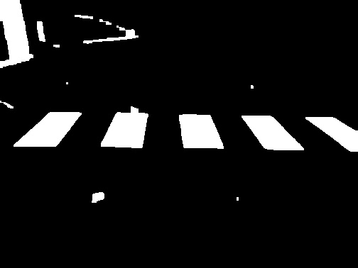
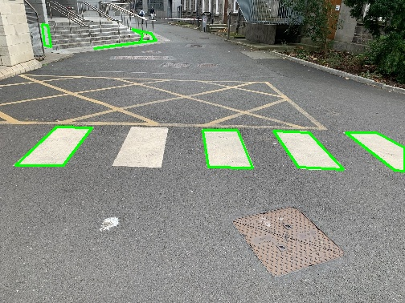
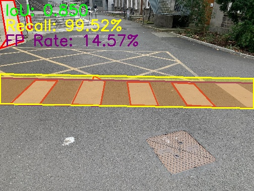
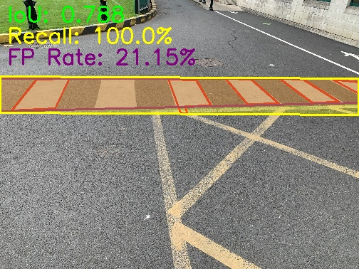

# Pedestrian_Crossing_detector
A computer vision implementation, that uses Non-Deep Learning techiniques to identify pedestrian crossings in an image.
## Introduction

This Project aims to detect Pedestrian crossings in images, by implementing traditional Computer
vision techniques on OpenCV. This project was coded in C++, and was designed using a dataset
of 10 images, and was verified on another 10 image test set. The ground truth was pre-defined
within the dataset, and the relevant metrics were calculated with this as reference to demostrate
the capabilities of the system.


The system follows a relatively simple method, so we can without over fitting tune the system to
detect pedestrian crossings in an image. The focus was to maximise the detection and reduce false
positives, while accepting small amounts of error in regional accuracy.
### Smoothing, De-noising of Image

To make these images suitable for further analysis and detection, we first need to perform certain
operations to de-noise the image from effects of salt and pepper noise, worn out paints and uneven
colours in the pictures. A simple Gaussian Blur with a 5x5 kernel was used for this purpose, which
provides smoothing and removes any minor noise.

### Thresholding to Binary


The image that now remain after the smoothing process, requires some filtering and we are
required to isolate the white marking on the road from the rest of the image, so we can perform
better detection. To perform this, the RGB was converted to Greyscale and then a threshold was
implemented to isolate the white parts of the images.


This threshold was tuned by experimentation and it was found that a threshold to allow pixel
values between 190 - 255, correctly gathered most of the white aspects of the image.

Post this thresholding, we performed some pre processing on this binary image before we pass it on
to extract the various regions in the Image. To remove the small holes and gaps in the image and
to smooth out edges, we apply some morphing operations of opening and closing. This removes a
lot of the small noisy components as can be seen above, and further make the boundaries of the
region more defined.

### Region Detection

2.3.1 Connected Components Analysis

Taking the isolated binary image above, we now perform Connected Components analysis to gather
all the regions in the image. This simple algorithm traverses images to find regions in images, by
assessing if they are connected together. It outputs all the different regions it identified.

This process also produces regions around different noise aspects of the image also selects regions
that do not resemble any pedestrian crossings.

2.3.2 Filtering Regions

Our aim was to detect the different individual rectangles of the pedestrian crossing, dependent of
several key factors including Area, Aspect Ratio & Neighbouring rectangles of the pedestrian
crossing.Assumptions

1. We assume that each pedestrian crossing will be not too far away from the camera.
2. We assume that we will be able to observe at least 2 white rectangles of the crossing in their
    full shape (not out of frame).

Filtering Criteria

To perform filtering of features that still remain in the binary image we approximate each region to
polygons. To do this we make use of the OpenCV’s approxPolyDP function, that allows to
approximate contours to polygons to a selected degree of resolution.

We were able to then consider the following filters in relation to the polygons properties:

1. Limiting regional area.

```
To remove regions that are too small or too large to be a pedestrian crossing rectangle, we
specify broad limits for the allowed area of each rectangle. These limits are not meant to be
harsh, but are in place to remove any obvious noisy elements in the thresholded image. These
thresholds were tuned in accordance to the image with the nearest crossing and the furthest,
and an extra allowance was added/decreases accordingly. It was found any region smaller
than 100 pixels (approximately 0.5% of the image), and any region bigger 2900 pixels was
way too big, even if the crossing was quite close in the image.
```
2. Aspect Ratio

```
Filtering for the width-to-height ratio of each region allows us to get rid of any features that
are not similar to the average ratio of the crossing marks. This was tuned by calculating the
average of a sample of aspect ratio’s of the crossings, and allowed for extra margins.
```
3. Neighbouring rectangles of the pedestrian crossing

```
The most important filter in place to prevent any other white-coloured regions to be detected
is the neighbouring quadrilaterals filter that essentially looks for neighbouring quadrilaterals
```

```
around a certain distance of the quadrilateral in question, that fits the required area & aspect
ratio requirements. Essentially a region is only identified as part of the crossing, if and only if
a similar white striped region is present near to it.
```


### Extrapolation for Final output

At this stage of processing, we assume all noise factors have been removed from the input image,
leaving only the white stripes of the pedestrian crossing, as shown in Figure 5

- Next, we reference the provided ground truths to understand how this extracted information
    can yield our final output.
       - The ground truth is given in the form of two straight lines, which limits our scope for
          comparison and calculation of other relevant metrics.
       - To better visualize the ground truth, we plotted a bounding box using these lines, giving
          a clearer representation of the expected output, as shown in Figure 6.

- With the ground truth now established, we proceed to the final step in our system:
    extrapolating the detected white stripes to define the crossing region and drawing the
    bounding box.
- We are required to output two lines that define the top and bottom edges of the crossing,
    which can then be used to create a bounding box.
       - For this purpose, we employ theRANSAC(Random Sample Consensus) technique,
          which is particularly effective at drawing lines through noisy data.

- RANSAC randomly selects pairs of points in a loop, aiming to find a set of points that
    form a line best fitting the rest of the data. Though the algorithm operates
    non-deterministically, it typically yields high-quality outputs.
- Using RANSAC, we identify the line (either top or bottom) in the image that best aligns
with the data. We then project perpendicularly to this line to find the furthest point and
draw a parallel line to define the second boundary.
- Examples of these outputs, superimposed on the original image, are shown below.



